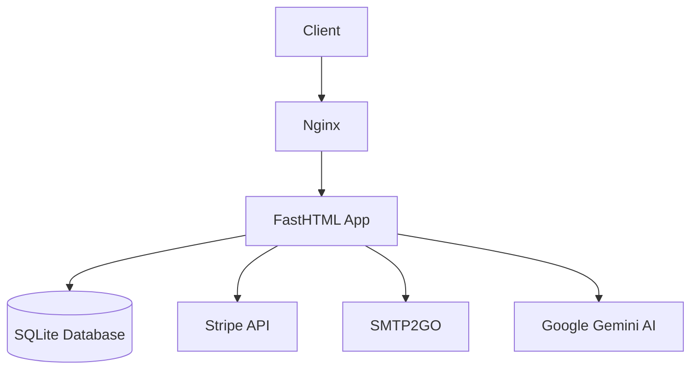

# Feedback to Me - 360° Feedback Platform

A modern web application for collecting and analyzing 360° feedback, built with Python and FastHTML.

[](https://feedback-to.me)
[](LICENSE)


## Features

- 🧑💻 User authentication with email confirmation
- 🔄 360° feedback collection process management
- 📊 AI-powered feedback analysis & report generation
- 💳 Integrated Stripe payments for credit purchases
- 📧 SMTP email integration for notifications
- 📱 Responsive web interface

## Table of Contents
- [Architecture](#architecture)
- [Quick Start](#quick-start)
- [Configuration](#configuration)
- [Deployment](#deployment)
- [Development](#development)
- [Testing](#testing)
- [API Documentation](#api-documentation)

## Architecture



Key Components:
- **Web Server**: FastHTML with Python backend
- **Database**: SQLite (production-ready version uses PostgreSQL)
- **AI Processing**: Google Gemini via LangChain integration
- **Payments**: Stripe Checkout integration
- **Email**: SMTP2GO service

## Quick Start

### Prerequisites
- Python 3.10+
- SQLite3
- Node.js (for optional frontend builds)

```bash
# Clone repository
git clone https://github.com/yourusername/feedback-to-me.git
cd feedback-to-me

# Create virtual environment
python -m venv venv
source venv/bin/activate

# Install dependencies
pip install -r requirements.txt

# Set up environment variables
cp .env.example .env
```

## Configuration

Edit `.env` file:

```ini
# Core Configuration
DEV_MODE=true
LOG_LEVEL=DEBUG
BASE_URL=http://localhost:8080

# External Services
STRIPE_SECRET_KEY=sk_test_...
SMTP2GO_API_KEY=your_smtp2go_key
GEMINI_API_KEY=your_google_ai_key

# Security
SECRET_KEY=your_random_secret_here
```

Required API Keys:
1. [Stripe](https://dashboard.stripe.com/test/apikeys)
2. [SMTP2GO](https://www.smtp2go.com/settings/api/)
3. [Google AI Studio](https://makersuite.google.com/)

## Deployment

Production deployment (currently running at https://feedback-to.me):

```bash
# Using Docker
docker build -t feedback-app .
docker run -d -p 8080:8080 \
  -e STRIPE_SECRET_KEY=$STRIPE_PROD_KEY \
  -e SMTP2GO_API_KEY=$SMTP_PROD_KEY \
  feedback-app
```

Production environment features:
- HTTPS via Let's Encrypt
- PostgreSQL database
- Gunicorn + Nginx reverse proxy
- Automated backups
- Monitoring via Prometheus/Grafana

## Development

```bash
# Start development server
make dev

# Run tests
make test

# Generate database schema diagram
python -m eralchemy2 -i sqlite:///data/feedback.db -o docs/erd.png
```

File Structure:
```
├── data/               # Database files
├── static/             # Static assets
├── tests/              # Test suite
├── main.py             # Main application
├── models.py           # Database models
├── pages.py            # UI templates
├── llm_functions.py   # AI processing
└── config.py           # Configuration defaults
```

## Testing

Test payment flow using Stripe test cards:
- Card: 4242 4242 4242 4242
- Exp: Any future date
- CVC: Any 3 digits

```bash
# Run full test suite
pytest tests/ --cov=app --cov-report=html
```
---

**Live Alpha Version**: https://feedback-to.me  
**Support**: contact@feedback-to.me  
**License**: MIT
